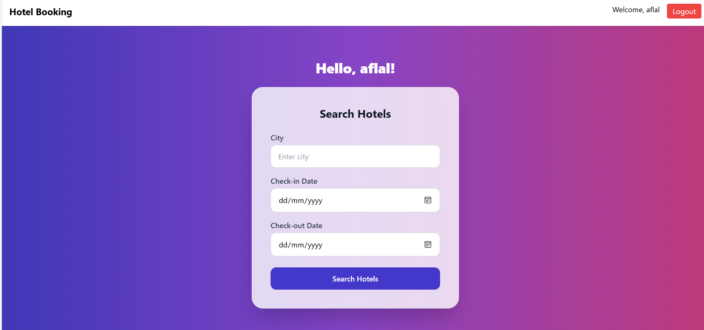
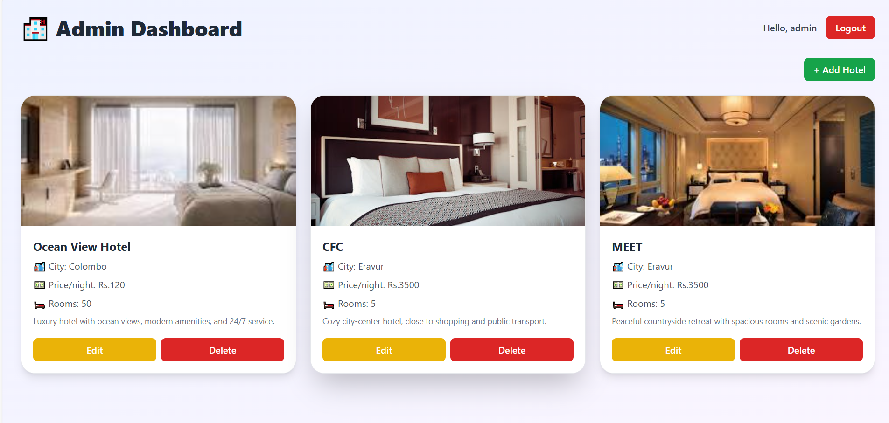
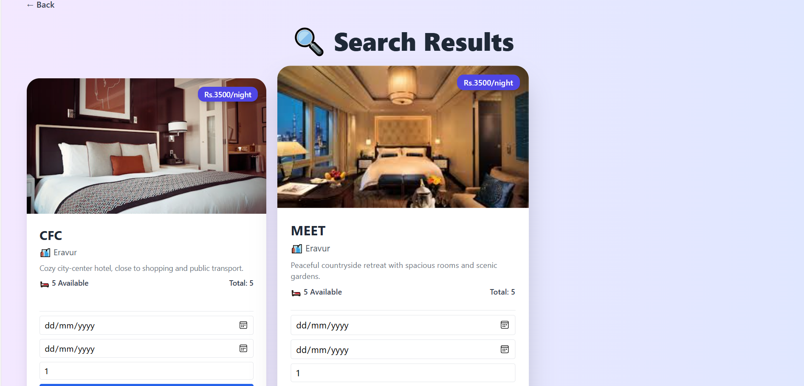
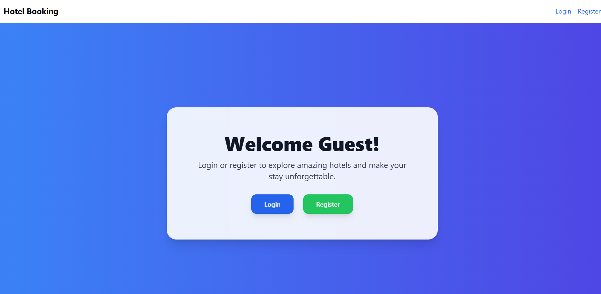
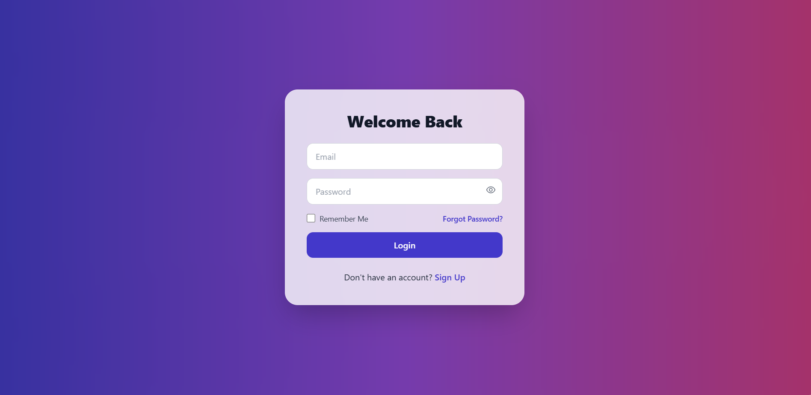
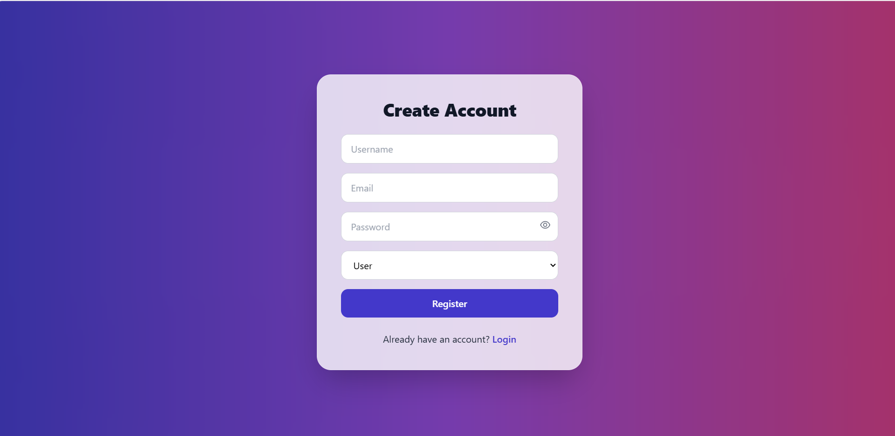

# 🏨 MERN Hotel Booking App


A modern **hotel booking application** built with the MERN stack (MongoDB, Express, React, Node.js). This project allows users to search hotels by city, check availability, book rooms, and admin to manage hotels with images and details.

---

## 🚀 Features

- User can **search hotels** by city and check-in/check-out dates
- View **hotel details, price, availability, and description**
- **Book hotels** instantly with live room availability check
- Admin panel to **Add / Edit / Delete hotels**
- Upload multiple **hotel images**
- Responsive and modern **UI with Tailwind CSS**

---

## 🛠️ Tech Stack


---

## 👤 Admin Credentials

Email: admin@example.com
Password: admin123
> Use these credentials to access the admin panel.


---

## 💻 Screenshots






---


## 📦 Installation & Run Locally

1. **Clone the repo**
```bash
git clone https://github.com/AflalMohamed/Mern-Booking.git


#Backend Setup
cd backend
npm install
npm run dev

#Frontend Setup
cd frontend
npm install
npm start
Open in browser: http://localhost:3000

📄 License

This project is licensed under the MIT License.
See LICENSE
 for details.

Made with ❤️ by Aflal Mohamed